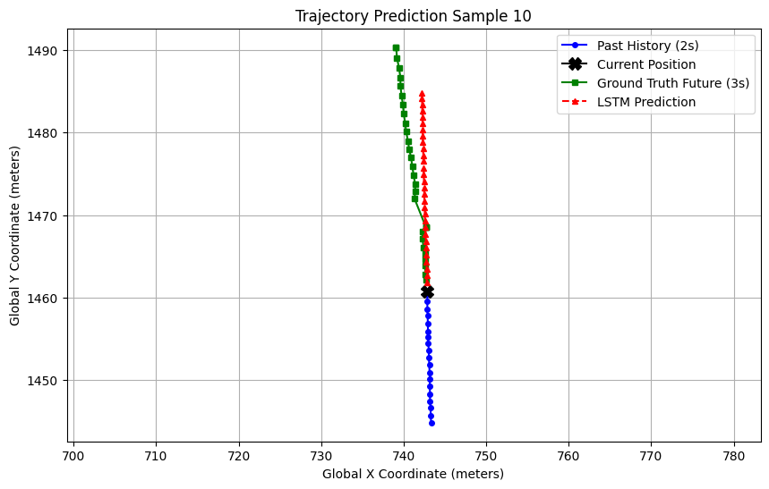
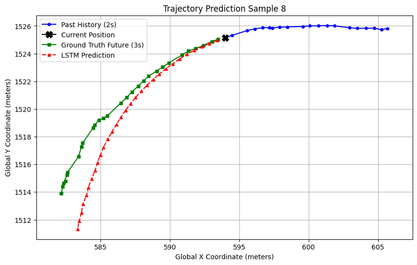

# Autonomous Vehicle Trajectory Prediction: End-to-End Deep Learning Pipeline

## 📌 Strategic Overview
Trajectory prediction is a cornerstone of Autonomous Vehicle software architecture. This repository contains **Phase 1** of an end-to-end trajectory forecasting pipeline built on the Argoverse dataset. 

The primary objective of this phase was to establish a robust mathematical and data-engineering foundation—solving for spatial coordinate normalization, resolving heavy I/O bottlenecks, and establishing a Sequence-to-Vector LSTM baseline to evaluate geometric displacement errors.

## 🚀 Key Engineering Milestones

* **Agent-Centric Spatial Normalization:** Engineered a custom coordinate transformer that translates and rotates global coordinate histories relative to the ego-vehicle's dynamic heading. This enforces translation-invariant learning across the dataset.
* **System-Level I/O Optimization:** Identified a critical CPU-bound text-parsing bottleneck caused by raw CSV extraction. Architected a vectorized pre-processing script to serialize sequence data into binary PyTorch tensors (`.pt`), increasing data-loader throughput by >75% and maximizing GPU compute utilization.
* **Geometric Performance Benchmarking:** Evaluated network accuracy using real-world metrics—Average Displacement Error (ADE) and Final Displacement Error (FDE)—mapped directly back to true global coordinates.

## 🧠 Phase 1 Architecture: Seq-to-Vector LSTM
The baseline model utilizes a 2-layer Long Short-Term Memory (LSTM) network.
* **Input (History):** $2.0$ seconds of vehicle trajectory ($20$ frames at $10$Hz). Features include normalized $[X, Y]$ coordinates and computed velocity vectors $[V_x, V_y]$.
* **Output (Horizon):** $3.0$ seconds of future path prediction ($30$ frames).

## 📊 Results & Architectural Insights

The baseline model effectively captures velocity and momentum for linear paths, but highlights the structural boundaries of sequence-only architectures when predicting non-linear geometry without spatial context.

### 1. Linear Trajectory Mastery (Sample 10)
For straight-line driving, the model perfectly captures intent, velocity, and heading, tracking the ground truth with minimal displacement error.

  

### 2. The Geometric Boundary: Under-steering (Sample 8)
When the vehicle transitions into a sharp, non-linear turn, the model captures the *intent* to turn but exhibits a classic parallel offset (under-steering). This validates that while the LSTM understands historical momentum, a pure Sequence-to-Vector decoder lacks the spatial awareness required for complex map geometry.

  

---

## 💻 Installation & Usage

1. Environment Setup

pip install -r requirements.txt
git clone [https://github.com/YOUR-USERNAME/Argoverse-Trajectory-Prediction-LSTM.git](https://github.com/YOUR-USERNAME/Argoverse-Trajectory-Prediction-LSTM.git)

3. Data Pre-processing (Vectorization)
Convert raw Argoverse .csv tracks into optimized binary tensors:

python scripts/preprocess_data.py --source data/raw/train --dest data/tensors/train

3. Training the Model
Launch the training loop (configured for GPU execution by default):

python scripts/train.py 

4. Evaluation & Visualization
Generate global coordinate plots against the validation/test splits:

python scripts/test_and_visualize.py

🗺️ Roadmap: Phase 2
To address the under-steering limitations observed in Phase 1, the next iteration of this architecture will focus on:

True Seq2Seq Architecture: Transitioning from a flat linear projection to a Recurrent Decoder to maintain step-by-step geometric momentum.

Spatial Conditioning: Extracting HD map features (lane centerlines, drivable area boundaries) and appending them to the latent context vector to anchor predictions to real-world topology.

Multi-Modal Horizons: Implementing probability-weighted multi-path generation to account for intersection branching (e.g., turning left vs. going straight).

📬 Contact
Ramkumar Karunakaran https://www.linkedin.com/in/ramkumar6karuna/
